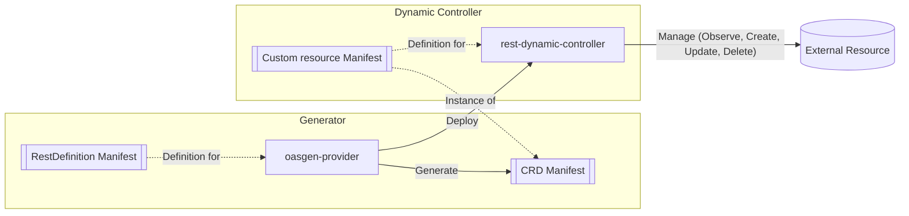

# Overview

The OASGen Provider is a Kubernetes controller that generates Custom Resource Definitions
(CRDs) and controllers to manage resources directly from OpenAPI Specification (OAS)
3.0/3.1 documents. It makes any (sufficiently consistent) OpenAPI-described REST API
manageable as a first-class Kubernetes resource without writing a custom operator.

## Glossary

| Term | Definition |
|------|------------|
| **RestDefinition** | The CR owned by oasgen-provider that declares how one external API resource is managed in Kubernetes based on an OAS document. |
| **RDC (rest-dynamic-controller)** | The generic controller image deployed by oasgen-provider — one Deployment per RestDefinition — that reconciles the generated resource against the external API. |
| **Resource CRD** | The CRD oasgen-provider generates from the OAS schema (e.g. `Repo`). |
| **Configuration CRD** | The companion CRD (e.g. `RepoConfiguration`) generated for authentication and declared configuration parameters. |
| **External system** | The service/API managed through the generated resources. |
| **Plugin (wrapper web service)** | An optional adapter service between RDC and an inconsistent external API. |

## Why not a hand-written operator

- **No operator boilerplate**: one `RestDefinition` pointing at an OAS file yields the
  CRD, the controller Deployment, and its RBAC.
- **OAS as the single source of truth**: the generated CRD schema always matches the API
  contract (typed spec/status, server-side validation).
- **Isolated blast radius**: each RestDefinition gets its own RDC Deployment; a
  misbehaving API affects only its own controller.
- **Zero-code extensibility**: supporting a new API is authoring an OAS + a
  RestDefinition, not writing Go.

## The pipeline

1. A user applies a `RestDefinition` CR.
2. oasgen-provider fetches the OAS document (`configmap://` or `http(s)://`).
3. It generates the resource CRD (and the `*Configuration` CRD when auth or
   `configurationFields` require one) from the OAS schema.
4. It deploys a dedicated RDC instance (Deployment + ConfigMap + RBAC) parameterized on
   the generated group/version/resource.
5. The RDC reconciles CR instances: the CR in Kubernetes is the **source of truth**, and
   the controller drives the external system to match it (observe, create, update,
   delete).

With a plugin, step 5 goes through the wrapper web service for the endpoints whose
`servers` entry in the OAS points at it — per-operation, not global (see
[when a plugin is needed](#when-a-plugin-wrapper-web-service-is-needed)).

## Verbs and actions

Krateo controllers implement four reconcile verbs; a RestDefinition maps them onto five
**actions** bound to HTTP endpoints of the OAS:

| Verb | Action(s) | Purpose |
|---|---|---|
| Observe | `findby`, `get` | Fetch current external state (`findby` searches a collection by human-friendly identifiers; `get` fetches one resource by technical id). |
| Create | `create` | Create the external resource. |
| Update | `update` | Update it on drift. |
| Delete | `delete` | Delete it (must be idempotent). |

The action semantics, when each is needed, and the newer per-verb tuning surface
(field mappings, transforms, async polling, status-code overrides) are specified in
[api.md](./api.md).

## How the RDC is deployed: mount-and-render

The RDC templates are **chart content, not code**: `helm/oasgen-provider/assets/rdc/`
(deployment, configmap, RBAC) is wrapped into ConfigMaps by the chart and mounted into
the provider pod at `/tmp/assets/rdc-deployment`, `/tmp/assets/rdc-configmap` and
`/tmp/assets/rdc-rbac`. The provider renders those templates for every RestDefinition —
whichever copy is installed **is** the controller's behaviour. This is the same
mechanism krateo core-provider uses to spawn its CDCs. Consequences:

- The RDC image every generated controller runs is pinned by `rdc.image.tag` in the
  chart values — a hand-maintained joint-contract pin (see
  [configuration.md](./configuration.md)).
- RDC behaviour changes ship as chart releases, without touching this repo's Go code.

The provider also manages per-namespace RBAC dynamically: it tracks which Secrets the
`*Configuration` CR instances reference (`status.authSecretDigest`) and maintains
namespace-scoped Role/RoleBindings granting the RDC ServiceAccount read access to exactly
those Secrets (`status.authSecretRBACNamespaces`).

## When a plugin (wrapper web service) is needed

RDC compares CR fields against API response fields at the same level and with the same
names. Much API inconsistency is now absorbed **declaratively** in the RestDefinition —
`fieldMapping` (with `alias`/`jq` value mapping, `inResponse` relocation,
`defaultIfAbsent`), `requestTransform`/`responseTransform`, `headers`, `queries`,
`successCodes`/`tolerateCodes`/`notFoundCodes`/`notFoundBody` — see
[api.md](./api.md). A plugin remains the answer when the gap is behavioural rather than
representational:

- **Multiple calls to fulfill one action** — e.g. Azure DevOps GitRepository, where
  `defaultBranch` exists only in the PATCH body, so create = POST then PATCH.
- **Server-side processing of values** the declarative transforms cannot express
  (bitwise/multi-call logic is explicitly out of jq scope).
- **Protocol bridging** — the external system speaks gRPC/GraphQL/anything non-REST; the
  plugin exposes a REST façade with its own OAS.

The plugin is wired per-operation by adding a `servers` override on that operation in the
OAS document; all other operations keep calling the real API. The step-by-step TeamRepo
walkthrough in the [USAGE_GUIDE](./USAGE_GUIDE.md) builds one.

## Place in the platform

The Krateo installer deploys oasgen-provider (feature `oasgenProvider`, on by default)
with its CRD chart. Downstream, provider-kog chart repos (GitHub, Azure DevOps, …)
package curated RestDefinitions + OAS ConfigMaps on top of it. RDC can additionally
delegate whole verbs to snowplow RESTActions (`observeApiRef`/`createApiRef`/…,
see [api.md](./api.md)), which couples it to the snowplow content API when — and only
when — those fields are used.
